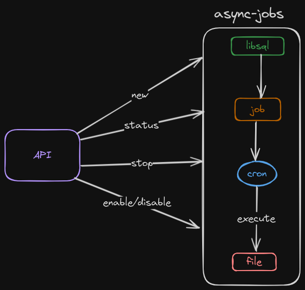

# Async Jobs

> [First make it work, then make it right, then make it fast. — @KentBeck](https://twitter.com/unclebobmartin/status/1784306424908030012)

This project has the goal to "manage" async jobs, when I say manage is not executing the one function, but is running and can execute many jobs asynchronously. 



## Problem/Solution

When I'm using PHP sometimes we need to execute tasks or jobs in the background, but the concept of Threads
was not implemented in a simple way on PHP, and sometimes we need to use many other tools to do that, for example: PHP send a message to one queue in RabbitMQ, and [Supervisord](http://supervisord.org/)
call other PHP/bash file who read the message of queue and run something stuff in one process.

For solving this, I thought in using the power of Go Lang to create a simple application.

# Required

Go lang
`1.21.4`

# Getting Started

If it's your first time run

`go mod tidy` or `go get .`

and to run the project

`go run.`

## Create/Configure .env (Required)

Create .env file in the root of project and configure the Turso variables.

You can do 

`cp example_env .env`

and fill the parameters

```
TURSO_DATABASE_URL=libsql://[DATABASE].turso.io
TURSO_AUTH_TOKEN=[TOKEN]
ENV=prod #prod or local, if not configured or any other value different of prod is local by default
```

I use like example to be executed this simple php file:

```Php
<?php

$arg = $argv[1];
$sec = random_int(11,15);
sleep($sec);
echo "item ".$arg." test ".$sec. " s";
```

You can do everything that you want inside this php file, send reports, process data and etc.
In the future I want to be possible execute any file that you want.


## Table (Optional)

When the application start is checked if the table job exists, if not create, but if this not happen you can run the following create table:

```sql
create table job (id INTEGER primary key AUTOINCREMENT,
    description varchar(50),
    name varchar(50),
    cron varchar (15),
    enabled boolean default false,
    executed int default 0,
    args varchar(150),
    id_cron INTEGER 
);
```

# Managment API

It was develop a simple API to CREATE, DISABLED/ENABLED, check STATUS and STOP a job.

## Create a New Job 

To create a new Job 

- URL:http://localhost:8080/job/new
- METHOD: POST

Important to see that in **args** you should pass:

- args: Can be a empty string you won't use
- cmd: The command that will running in the server 
- path: Path of file that should be executed 

Request:
```
curl --request POST \
  --url http://localhost:8080/job/new \
  --header 'Content-Type: application/json' \
  --data '{
	"description":"Api Job",
	"name": "api_job",
	"cron": "@every 1s", 
	"enabled": true,
	"args": {
		"args": "10",
		"cmd": "php",
		"path": "/home/dalton/Dev/personal/async-jobs/test.php"
	}
}'
```
Response:
```
{
	"Id": 10,
	"description": "Api Job",
	"name": "api_job",
	"cron": "@every 1s",
	"enabled": true,
	"executed": 0,
	"args": "2912321",
	"cronId": 0
}
```

## Job Status

To see the status of a Job 

- URL:http://localhost:8080/job/status/:id
- METHOD: GET
- Params:
-- id: The id of Job

Request:
```
curl --request GET \
  --url http://localhost:8080/job/status/10 \
  --header 'Content-Type: application/json' \
```

Response:
```
{
	"id": "10",
	"status": "Executing"
}
```

## Job Stop

To STOP the execution of the job, but if the application is restart this job stopped will start again

- URL:http://localhost:8080/job/stop/:id
- METHOD: GET
- Params:
-- id: The id of Job

Request:
```
curl --request GET \
  --url http://localhost:8080/job/stop/10 \
  --header 'Content-Type: application/json' \
```

The response is the own job

Response:
```
{
	"Id": 10,
	"description": "Api Job",
	"name": "api_job",
	"cron": "@every 1s",
	"enabled": true,
	"executed": 1,
	"args": "2912321",
	"cronId": 6
}
```

## Job Enable/Disable

- URL:http://localhost:8080/job/enabled/:id/:enabled
- METHOD: GET
- Params:
-- id: The id of Job
-- enabled: Value true or false 

Request:
```
curl --request GET \
  --url http://localhost:8080/job/enabled/10/true \
  --header 'Content-Type: application/json' \
```

Response:
```
{
	"enabled": "true",
	"id": "10",
	"status": "Job was Enabled with success"
}
```
